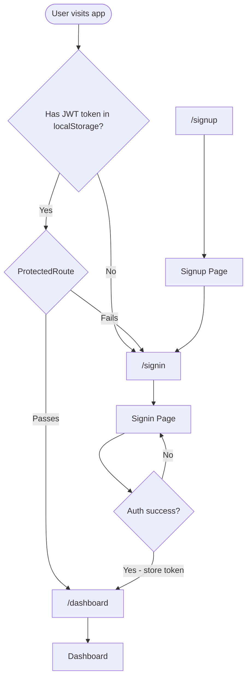
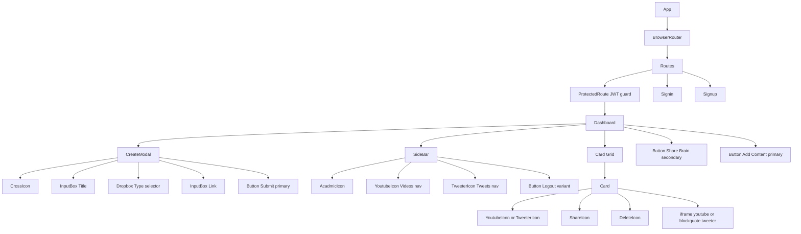
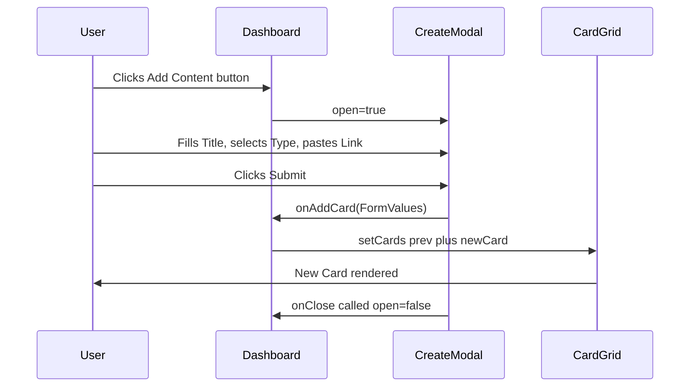
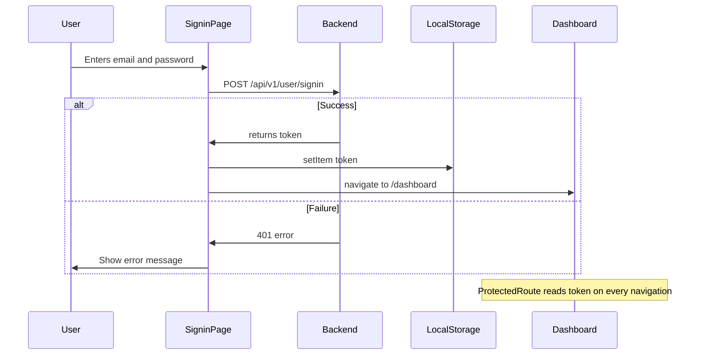
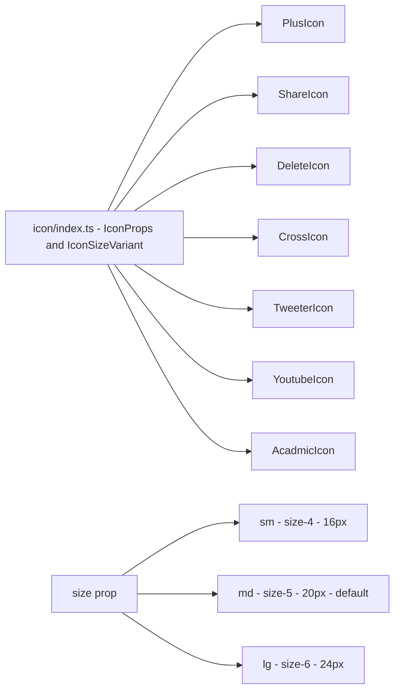
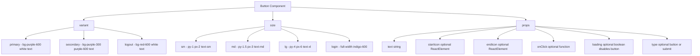
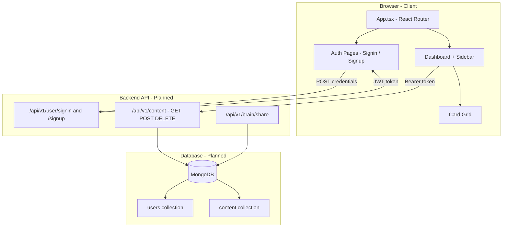

# Brainly Frontend

> **Development In Progress** - This project is actively being built. Features, components, and APIs are subject to change.

A **second-brain web application** that lets users save, organize, and share content from YouTube and Twitter/X all in one place. Built with React, TypeScript, Vite, and TailwindCSS v4.

---

## Project Status

```
██████████████████░░░░░░░   ~72% Complete
```

| Area | Status |
|------|--------|
| Project Setup and Tooling | Done |
| Design Tokens and Theme | Done |
| Icon System | Done |
| Button Component | Done |
| Card Component YouTube + Twitter | Done |
| InputBox Component | Done |
| Dropbox Component | Done |
| CreateModal Component | Done |
| SideBar Component | Done |
| ErrorBoundary Component | Done |
| Layout / Dashboard Shell | Done |
| Authentication Signin / Signup pages | Done |
| Protected Route Guard | Done |
| React Router Integration | Done |
| Backend Integration | Planned |
| Share Brain Feature | Planned |
| Search and Filter | Planned |

---

## Tech Stack

| Technology | Version | Purpose |
|---|---|---|
| React | 19 | UI Framework |
| TypeScript | ~6.0 | Type Safety |
| Vite | 8 | Build Tool and Dev Server |
| TailwindCSS | v4 | Styling |
| React Router DOM | v7 | Client-side routing |

---

## Project Structure

```
brainly-frontend/
├── src/
│   ├── component/
│   │   ├── ui/
│   │   │   ├── Button.tsx
│   │   │   ├── Card.tsx
│   │   │   ├── createModeal.tsx
│   │   │   ├── inputBox.tsx
│   │   │   ├── dropbox.tsx
│   │   │   ├── sideBar.tsx
│   │   │   └── protectedRRoute.tsx
│   │   └── ErrorBoundary.tsx
│   │
│   ├── icon/
│   │   ├── index.ts
│   │   ├── acadmicicon.tsx
│   │   ├── plusicon.tsx
│   │   ├── shareicon.tsx
│   │   ├── deleteicon.tsx
│   │   ├── crossicon.tsx
│   │   ├── tweetericon.tsx
│   │   └── youtubeIcon.tsx
│   │
│   ├── pages/
│   │   ├── dashboard.tsx
│   │   ├── signin.tsx
│   │   └── signup.tsx
│   │
│   ├── App.tsx
│   ├── App.css
│   ├── index.css
│   └── main.tsx
│
├── index.html
├── vite.config.ts
├── tsconfig.json
└── package.json
```

---

## Architecture Diagrams

### 1. Application Routing



---

### 2. Component Tree



---

### 3. Data Flow - Adding Content



---

### 4. Authentication Flow



---

### 5. Icon System



---

### 6. Button Variants and Sizes



---

### 7. Planned Full-Stack Architecture



---

## Getting Started

### Prerequisites

- Node.js >= 18
- npm >= 9

### Install and Run

```bash
# Clone the repository
git clone <repo-url>
cd brainly-frontend

# Install dependencies
npm install

# Start development server
npm run dev
```

Open http://localhost:5173 in your browser.

### Available Scripts

| Command | Description |
|---|---|
| npm run dev | Start the Vite dev server with HMR |
| npm run build | Type-check and build for production |
| npm run preview | Preview the production build locally |
| npm run lint | Run ESLint across the codebase |

---

## Components

### Button
> src/component/ui/Button.tsx

Flexible button with three visual variants, four size options, optional leading/trailing icons, and a loading state.

```tsx
<Button variant="primary" size="md" text="Add Content" startIcon={<PluseIcon />} onClick={() => setOpen(true)} />

// Loading state - disables click and shows 50% opacity
<Button variant="primary" size="login" text="Signing in..." loading={true} type="submit" />
```

### Card
> src/component/ui/Card.tsx

Displays a saved content card. Renders a YouTube iframe or Twitter blockquote based on the type prop. YouTube links in both youtu.be/ and watch?v= formats are supported.

```tsx
<Card type="youtube" link="https://youtu.be/..." title="React Crash Course" />
<Card type="tweeter" link="https://x.com/..." title="Interesting Thread" />
```

### CreateModal
> src/component/ui/createModeal.tsx

A centered overlay modal for adding new content. Accepts an onAddCard callback so the parent Dashboard can append the new card to state.

```tsx
<CreateModal
  open={isOpen}
  onClose={() => setIsOpen(false)}
  onAddCard={(card) => setCards(prev => [...prev, card])}
/>
```

### SideBar
> src/component/ui/sideBar.tsx

Fixed left sidebar with brand logo, navigation links (Videos, Tweets), and a Logout button that clears the JWT token and redirects to /signin.

### ProtectedRoute
> src/component/ui/protectedRRoute.tsx

React Router layout route that checks for a token in localStorage. Unauthenticated users are redirected to /signin.

```tsx
<Route element={<ProtectedRoute />}>
  <Route path="/dashboard" element={<Dashboard />} />
</Route>
```

### Input
> src/component/ui/inputBox.tsx

A simple controlled text input field.

```tsx
<Input placeholder="Title" onchange={(e) => setTitle(e.target.value)} />
```

### Icons
> src/icon/

All icons accept an optional size prop: sm, md, or lg.

```tsx
import { AcadmicIcon } from "./icon/acadmicicon";
<AcadmicIcon size="lg" />
```

---

## Roadmap

- [x] Project setup - Vite + React + TypeScript + TailwindCSS v4
- [x] Icon system - AcadmicIcon, PlusIcon, ShareIcon, DeleteIcon, CrossIcon, TweeterIcon, YoutubeIcon
- [x] Button component - primary / secondary / logout variants, sm/md/lg/login sizes, loading state
- [x] Card component - YouTube iframe embed and Twitter blockquote embed
- [x] CreateModal - overlay modal with Title + Type + Link inputs
- [x] SideBar - fixed sidebar with Videos / Tweets nav and Logout
- [x] Dashboard layout - sidebar + content grid
- [x] Authentication pages - Signin and Signup with form validation
- [x] Protected routes - JWT token guard via React Router
- [x] React Router - /signin, /signup, /dashboard routes
- [ ] Wire modal to backend - persist content via API calls
- [ ] Share Brain - generate a shareable read-only link
- [ ] Backend API - Node.js/Express + MongoDB separate repo
- [ ] Search and Filter - filter saved content by type / title
- [ ] Tagging System - categorize and organize saved content

---

## License

This project is for educational purposes as part of a full-stack development course (Week 15).

---

> This project is under active development. More features and documentation will be added as development progresses.
